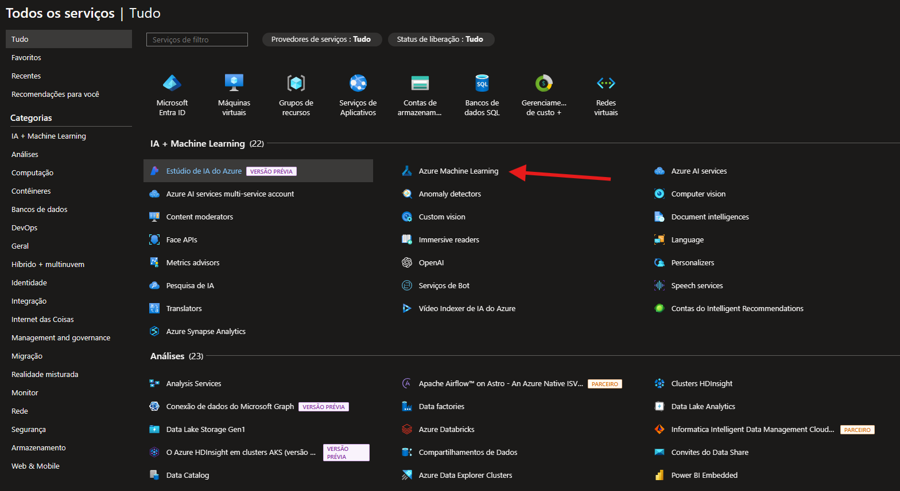
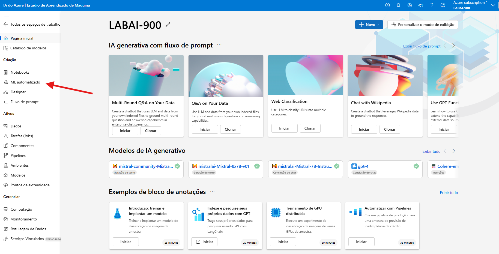
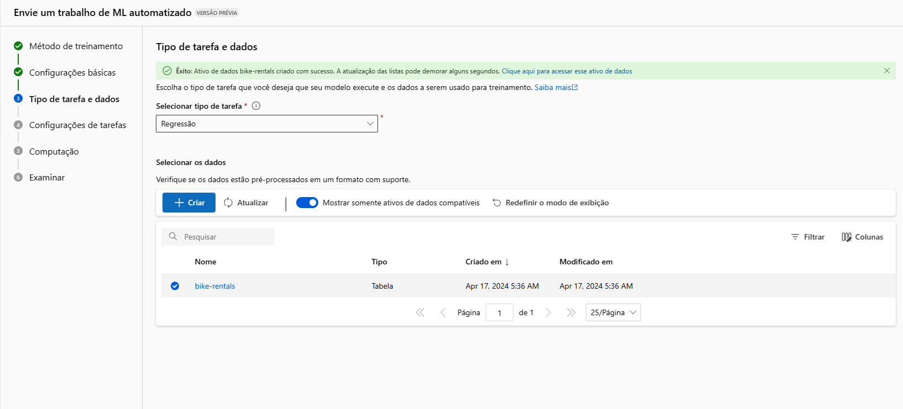
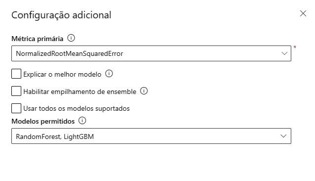
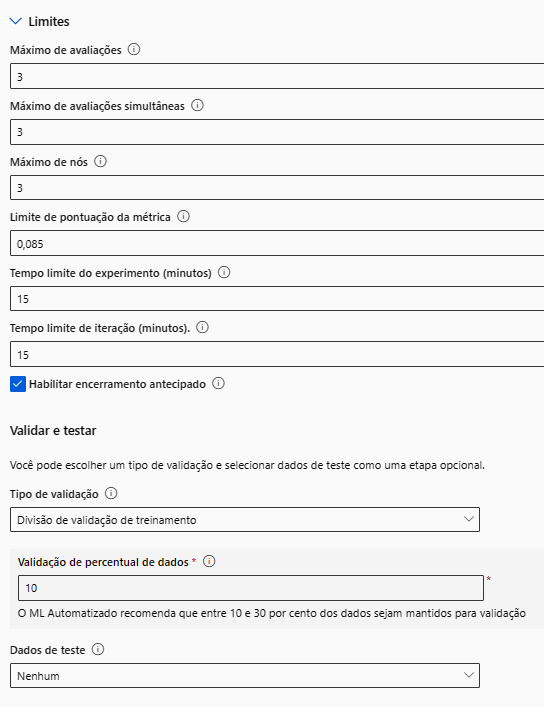
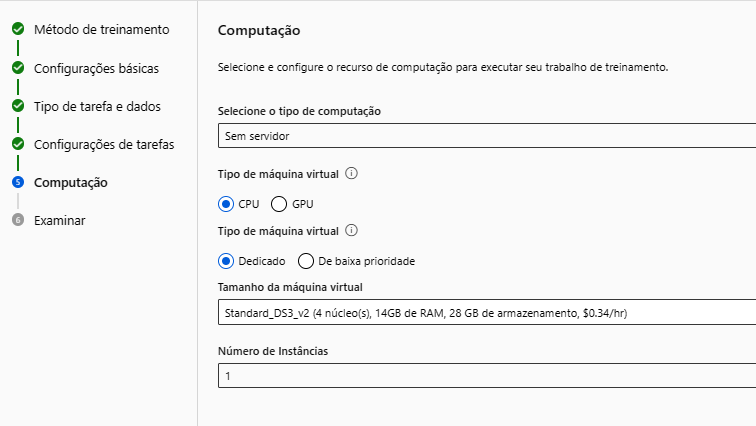
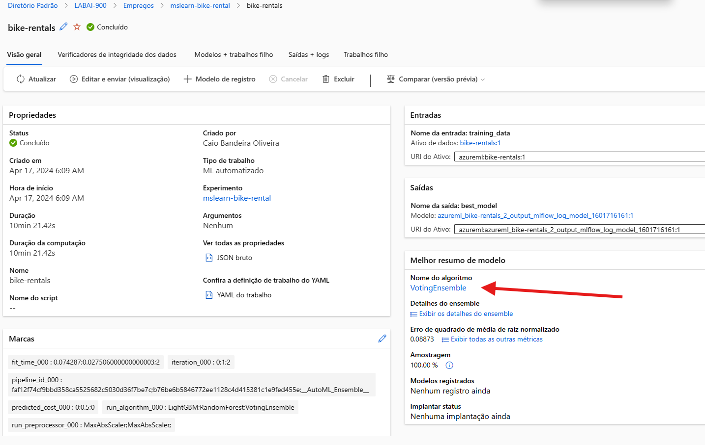
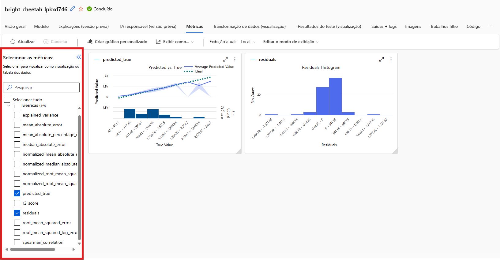
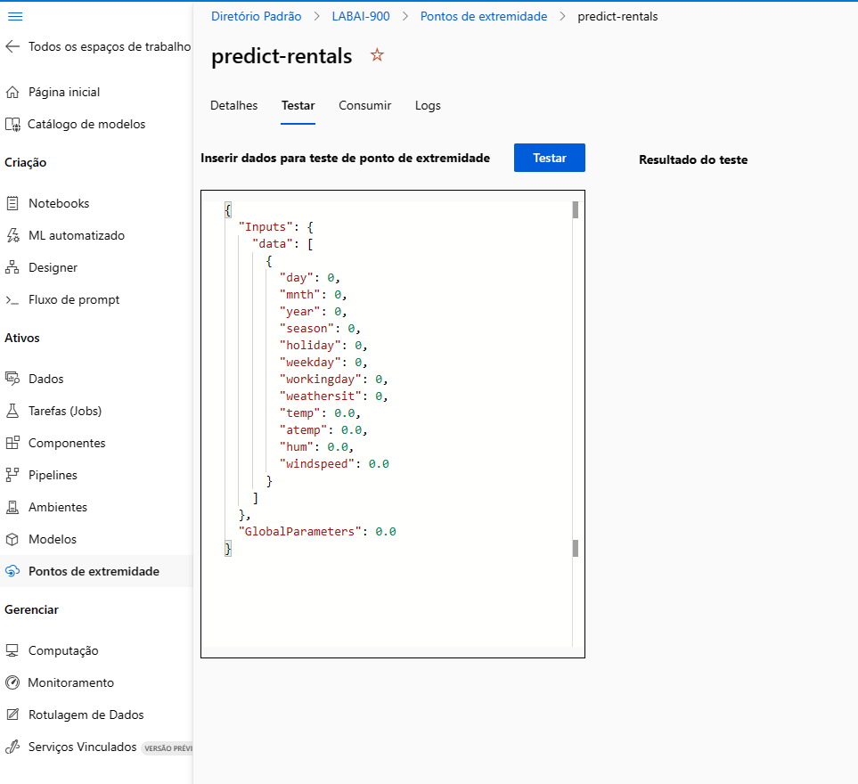
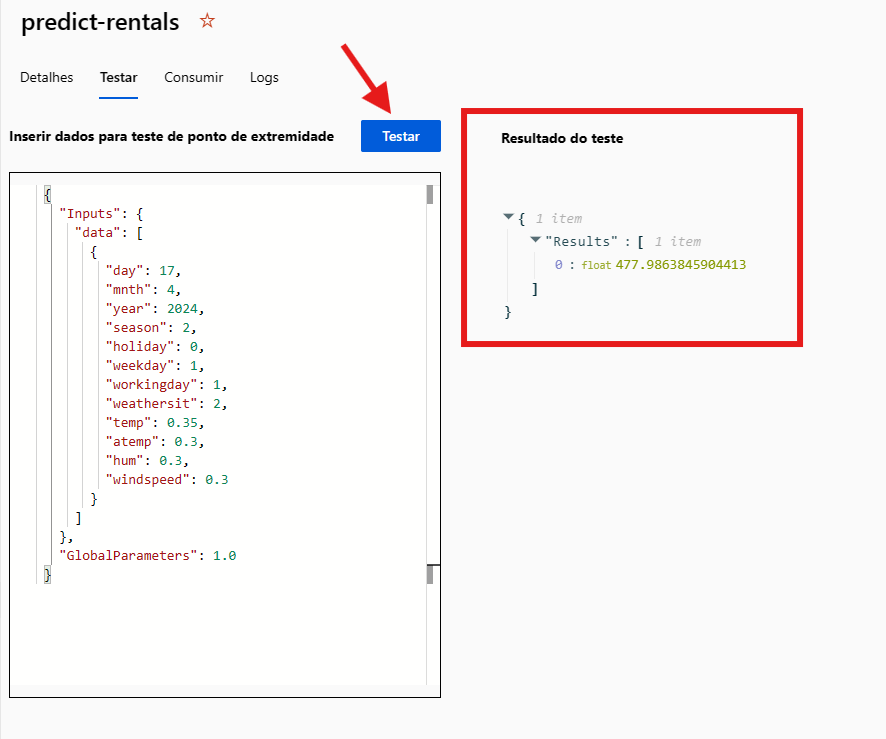

# Machine Learning Automatizado no Azure Machine Learning
Esse tutorial tem como objetivo usar os recursos de machine learning automatizado no Azure Machine Learning para treinar e avaliar um modelo de machine learning e em seguida implantar e testar o modelo treinado.

## Objetivo ⚔️
### Entrega do desafio da DIO 🛡️
 
 

 
 
Descrição do Desafio: 

    1. Crie um novo repositório no github com um nome a sua preferência.
    2. Crie um modelo de previsão com seus devidos pontos de extremidade configurados.
    3. Escreva o passo a passo desse processo em um readme.md de como você chegou nessa etapa.
    4. Salve nesse repositório o readme.md e o arquivo .json de pontos de extremidade.
    5. Compartilhe conosco o link desse repositório através do botão 'entregar projeto'.

    - Dio.

## Instruções📕

### Criar um workspace no Azure Machine Learning

    Nessa etapa iremos criar um workspace no Azure Machine Learning (AML), para em seguida usar o Estúdio do AML.

1 - Entre no [Portal do Azure](https://portal.azure.com) e logue a sua conta da Microsoft.

2 - Clique na opção "mais serviços" em seguida você será levada para a página da imagem abaixo e irá clicar em **Azure Machine Learning** em seguida clique em "➕ Criar" e crie um Workspace. 

3 - Em seguida preencha o que é pedido (Caso não tenha um grupo de recursos clique em "criar novo"), após clique em "Examinar + Criar" e após a Validação aprovada clique em "Criar"(isso pode demorar alguns minutos).
    

Lista de Campos para Preencher

    • Assinatura: sua assinatura do Azure.
    
    • Grupo de recursos: crie ou selecione um grupo de recursos.
    
    • Nome: insira um nome exclusivo para o seu workspace.
    
    • Região: selecione a região geográfica mais próxima.
    
    • Conta de armazenamento: anote a nova conta de armazenamento padrão que será criada para 
      o workspace.
    
    • Cofre de chaves: anote o novo cofre de chaves padrão que será criado para o workspace.
    
    • Application Insights: anote o novo recurso Application Insights padrão que será criado para o workspace.
    
    • Registro de contêiner: nenhum (será criado um automaticamente quando você implantar um modelo em um contêiner pela primeira vez).

**Exemplo:**
<b>
Você pode preencher como quiser. Abaixo é apenas um Exemplo.
</b>
<b>
Configuração feita:
</b>

4 - Clique ir para recurso, selecione "iniciar o estúdio" (Caso contrário, selecione Todos os workspaces no menu à esquerda e selecione o workspace que você acabou de criar).

### Usar aprendizado de máquina automatizado para treinar um modelo
    Se você cumpriu todas as etapas anteriores com êxito, você será encaminhado para o Estúdio de Aprendizado de Máquina.

1 - No estúdio do Azure Machine Learning, veja a página ML Automatizado.

2 - Crie um novo trabalho de ML automatizado com as seguintes configurações, usando Avançar conforme necessário para avançar dentro da interface do usuário:

Configurações de Exemplo e Campos a ser Preenchidos

    <b>
Você pode preencher conforme a sua necessidade. Abaixo é apenas um Exemplo.
</b>
    <b>
Configuração feita:
</b>

    Nome do trabalho: mslearn-bike-automl
    Nome do novo experimento: mslearn-bike-rental
    Descrição: machine learning automatizado para previsão de aluguel de bicicletas
    Marcas: nenhuma
    
    Tipo de tarefa e dados:

        Selecionar tipo de tarefa: regressão

        Selecionar conjunto de dados: crie um novo conjunto de dados com as seguintes configurações:

        Tipo de dados:
       
            • Nome: bike-rentals
            • Descrição: dados históricos de aluguel de bicicletas
            • Tipo: tabular

        Fonte de dados:
       
            • Selecione De arquivos da Web

        URL da Web:
       
            • URL da Web: https://aka.ms/bike-rentals
            • Ignorar validação de dados: não selecionar

        Configurações:
    
            • Formato de arquivo: delimitado
            • Delimitador: vírgula
            • Codificação: UTF-8
            • Cabeçalhos de coluna: somente o primeiro arquivo tem cabeçalhos
            • Ignorar linhas: Nenhum
            • O conjunto de dados contém dados multilinhas: não selecione

        Esquema:
    
            • Incluir todas as colunas que não sejam Caminho (Path)
            • Examinar os tipos detectados automaticamente e avance.

        
    Selecione Criar. Após a criação do conjunto de dados, selecione o conjunto de dados de aluguel de bicicletas para continuar a enviar o trabalho do ML Automatizado.

ㅤ

3 - Após aparecer que foi concluído com êxito, selecione o tipo de tarefa e selecione o conjunto de dados criado e avance.

    
Configurações da tarefa

    <b>
Você pode preencher conforme a sua necessidade. Abaixo é apenas um Exemplo.
</b>
    <b>
Configuração feita:
</b>

        Tipo de tarefa: regressão
        Conjunto de dados: bike-rentals
        Coluna de destino: aluguéis (inteiro)
        
        Definições de configuração adicionais:
        
            • Métrica primária: erro quadrático médio da raiz normalizada
            
            • Explicar o melhor modelo: não selecionado
            
            • Usar todos os modelos com suporte: Não selecionado. Você restringirá o trabalho para experimentar apenas alguns algoritmos específicos.
            
            • Modelos permitidos: selecione apenas RandomForest e LightGBM. O ideal seria tentar usar o máximo possível, mas cada modelo adicionado aumenta o tempo necessário para executar o trabalho.
        
        Limites: expanda esta seção
            • Avaliações máximas: 3
            • Máximo de avaliações simultâneas: 3
            • Máximo de nós: 3
            • Limite de pontuação da métrica: 0,085
            • Tempo limite: 15
            • Tempo limite de iteração: 15
            • Habilitar encerramento antecipado: selecionado
        
        Validação e teste:
            • Tipo de validação: divisão de validação de treinamento
            • Percentual de dados de validação: 10
            • Conjunto de dados de teste: nenhum

ㅤ

Computação

    Selecionar tipo de computação: sem servidor
    Tipo de máquina virtual: CPU
    Camada da máquina virtual: dedicada
    Tamanho da máquina virtual: Standard_DS3_V2*
    Número de instâncias: 1

ㅤ

4 - Envie o trabalho de treinamento. Ele é iniciado automaticamente.

5 - Aguarde a conclusão do trabalho. Isso pode demorar um pouco.

### Examinar o melhor modelo
    Quando o trabalho de machine learning automatizado for concluído, você poderá examinar o melhor modelo treinado.

1 - Na guia **visão geral** vá até o resumo do melhor modelo e clique.

2 - Vá até a guia **Métricas** e selecione os gráficos residuais e predicted_true

    Examine os gráficos que mostram o desempenho do modelo. O gráfico de resíduos mostra os resíduos (as diferenças entre valores previstos e reais) como um histograma. O gráfico predicted_true compara os valores previstos com os valores verdadeiros.

### Implantar e testar o modelo

1 - Na guia **Modelo** para obter o melhor modelo treinado pelo trabalho de machine learning automatizado, selecione **Implantar** e use a opção **serviço Web** para implantar o modelo com as seguintes configurações:

Configurações de Teste

    
    Nome: predict-rentals
    Descrição: prever aluguéis de bicicleta
    Tipo de computação: instância de Contêiner do Azure
    Habilitar autenticação: Selecionado

ㅤ

2 - Clique implantar e aguarde até o início da implantação – isso pode levar alguns segundos. O Status de implantação para o ponto de extremidade predict-rentals será indicado na parte principal da página como Em execução.

3 - Aguarde até que o Status de implantação mude para Bem-sucedida. (Isso pode demorar um pouco)

### Testar o serviço implantado
    Agora você irá testar o serviço implantado.

Em Estúdio do Azure Machine Learning, no menu à esquerda, selecione Pontos de Extremidade e abra o ponto de extremidade em tempo real predict-rentals.

Na página do ponto de extremidade em tempo real de previsão de aluguel, exiba a guia Teste.

No painel Dados de entrada para testar o ponto de extremidade, substitua o modelo JSON pelos seus dados de entrada:

4 - Em seguida clique **testar** e o **resultado do teste** aparecerá ao lado.

5 - Revise os resultados do teste, que incluem um número previsto de aluguéis com base nos recursos de entrada

**Esse foi o fim das etapas.**

OBS: O serviço Web que você criou está hospedado em uma Instância de Contêiner do Azure. Se você não pretender experimentá-lo ainda mais, exclua o ponto de extremidade para evitar o acúmulo de uso desnecessário do Azure, poderá haver cobranças se você estiver usando serviço pago.

## Fontes e Links Importantes 🔗

[Microsoft Instruções](https://microsoftlearning.github.io/mslearn-ai-fundamentals.pt-br/Instructions/Labs/01-machine-learning.html)

[Portal Azure](https://portal.azure.com)

